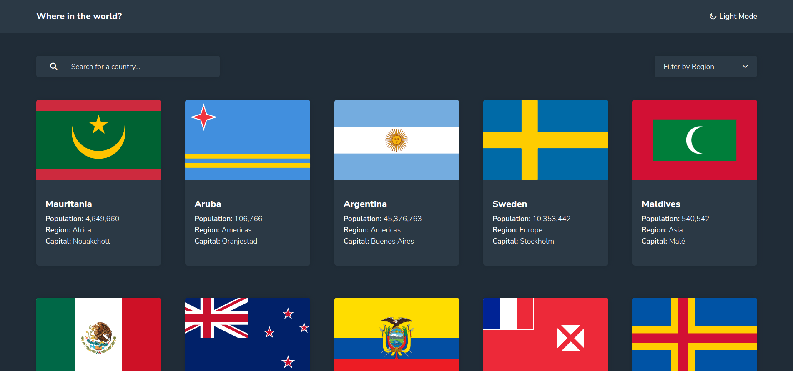

# REST Countries API with color theme switcher


## 👋 Welcome! 
Thanks for checking out this front-end coding challenge solution.


## 📖 Table of contents
  - [Overview](#overview)
    - [Features](#features)
    - [Screenshot](#screenshot)
    - [Built with](#built-with)
    - [Running the App Locally](#running-the-app-locally)
    - [Links](#links)
- [Author](#author)

## 🔍 Overview

### Features 📂

Users should be able to:

- See all countries from the API on the homepage
- Search for a country using an `input` field
- Filter countries by region
- Click on a country to see more detailed information on a separate page
- Click through to the border countries on the detail page
- Toggle the color scheme between light and dark mode

### Screenshot 📸



### Built with 🔨

- Bootstrap 5.2.3
- Mobile-first workflow
- ReactJS (React Hooks, Route)
- Styled-components
- [npmjs](https://www.npmjs.com/)
- [Goole Fonts](https://fonts.google.com/knowledge)
- [Fontawesome](https://fontawesome.com/)

### Running the App Locally 💻
This app runs on Node.js. If Node.js is installed, you may clone the repository and install its dependencies:
```
npm install
```

### Links 🔗

- Frontendmentor URL: 
- Solution URL: https://github.com/sn-tin/rest-countries
- Live Site URL: https://no-context.vercel.app

## 👩‍💻 Author

- Frontend Mentor - [@sn-tin](https://www.frontendmentor.io/profile/sn-tin)
- Github - [@sn-tin](https://github.com/sn-tin/)